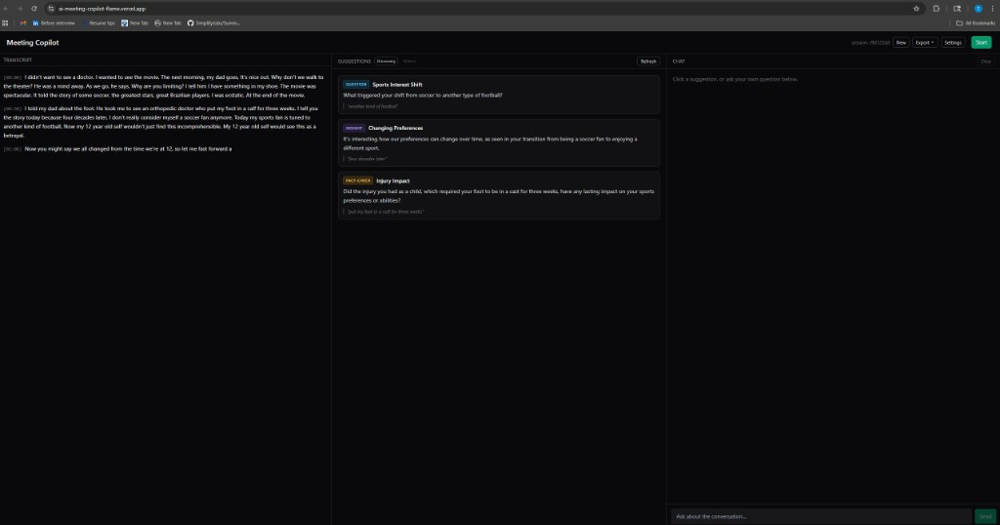

# Meeting Copilot

A real-time AI meeting copilot. Listens to a live microphone feed, streams a transcript, surfaces 3 context-aware suggestions every ~30s, and lets you click any suggestion (or type freely) to chat with the conversation as grounded context.

**Stack:** Next.js 15 (App Router) + TypeScript + Tailwind, Groq API for Whisper (STT) and LLaMA 3.3 70B / 3.1 8B (suggestions + chat + rolling summary).

- **Live demo:** https://ai-meeting-copilot-flame.vercel.app/
- **Source:** https://github.com/tungnguyenasu/AI-meeting-copilot



_Live on Vercel mid-session: sliding transcript window on the left, three phase-aware suggestions with anchor-quote grounding in the middle, click-to-chat on the right._

> Works best in Chrome or Edge (Safari's `MediaRecorder` doesn't emit WebM/opus reliably). Bring your own Groq key via the in-app Settings drawer if the shared one is rate-limited.

---

## Quickstart

```bash
# 1. Install
npm install

# 2. Add your Groq key
cp .env.local.example .env.local
#   edit .env.local and set GROQ_API_KEY=...
#   (grab one free at https://console.groq.com/keys)

# 3. Run
npm run dev
#   http://localhost:3000
```

The server key is the default. Users can **BYOK** (bring-your-own-key) via the in-app Settings drawer — the key lives in `localStorage` and is sent per-request as the `x-groq-api-key` header. Handy for demoing with a reviewer's key.

### Optional: persist across restarts / deploy to Vercel

Local dev keeps everything in-memory per Node process. For production (especially serverless multi-instance hosts like Vercel, where successive requests can land on different workers) flip the stores over to Upstash Redis:

```bash
STORE_BACKEND=redis
UPSTASH_REDIS_REST_URL=https://your-db.upstash.io
UPSTASH_REDIS_REST_TOKEN=...
```

Grab both values from [console.upstash.com](https://console.upstash.com/) (free tier covers this use case comfortably). The app autodetects the flag — no code changes, no redeploy, and local dev stays single-process + zero-config by default.

---

## What's inside

### 3-column UI

| Column | What it shows |
| --- | --- |
| **Transcript** | Live whisper output, ~30s per segment, timestamped |
| **Suggestions** | 3 smart, varied, anchored cards. Refreshed per new segment or by the Refresh button. Current **conversation phase** is pinned to the header. |
| **Chat** | Click a suggestion to seed a prompt, or ask anything freely. Streaming token-by-token, multi-turn, interruptible. |

Header controls: **Start/Stop** mic, **New** (fresh session), **Export ▾** (JSON or Markdown), **Settings** (key + prompt overrides).

### Core features

- **Chunked mic capture** — `MediaRecorder` rotates a fresh WebM/opus clip every 30s so Whisper always gets a self-contained file.
- **Sliding transcript window** — we only send the last ~2 minutes of text to the suggestion LLM (keeps latency flat, keeps suggestions focused on what's happening now).
- **Rolling summary** — older segments are condensed in the background by a cheaper model (`llama-3.1-8b-instant`), then prepended to the prompt as `OLDER_CONTEXT`. Keeps 30-minute conversations coherent without re-sending everything.
- **Phase detection** — each suggestion batch also returns `opening | discovery | deep-dive | decision | wrap-up | smalltalk`; the prompt asks for suggestion mixes tailored to each phase. (e.g. small-talk intentionally returns 0 suggestions — we don't want to spam the user during "how was your weekend".)
- **Anchor quotes** — every suggestion is grounded in a verbatim snippet from the transcript, rendered under the card, so you can tell at a glance where it came from.
- **Two-tier dedup** — recent titles are listed in the prompt; generated suggestions then go through a Jaccard trigram-similarity gate to drop near-duplicates the model sneaks past.
- **Whisper hallucination filter** — silence commonly makes Whisper emit "Thanks for watching!" / "you." / ".". A server-side block-list drops these before they hit the transcript and poison anchor quotes.
- **Multi-turn chat with transcript grounding** — prior turns replay as raw messages, but the latest turn is re-augmented with the freshest transcript window + rolling summary + (optionally) the clicked suggestion's metadata.
- **Interruptible streaming** — clicking a second suggestion while the chat is mid-stream aborts the in-flight request and starts the new one cleanly.
- **Session persistence** — `sessionId` lives in `localStorage`; on reload we call `GET /api/session` and rehydrate transcript, last suggestion batch, phase, summary, and chat history.
- **Export** — `GET /api/export?format=json|md` downloads the full session state as JSON or a nicely formatted Markdown report.

---

## Architecture

```
[Browser]
  ├── useRecorder ───── POST /api/transcribe (audio blob)
  ├── useSuggestions ── POST /api/suggestions (sessionId, optional prompt)
  ├── useChat ───────── POST /api/chat (streaming SSE-style plaintext)
  └── page.tsx ──────── GET  /api/session    (hydration on mount)
                        GET  /api/export     (download)

[Next.js server routes]  →  [services]  →  [stores]
  /api/transcribe     →  groq.audio.transcriptions (whisper-large-v3-turbo)
  /api/suggestions    →  suggestionService (llama-3.3-70b-versatile)
                         + maybeRefreshSummary (llama-3.1-8b-instant, bg)
  /api/chat           →  chatService (llama-3.3-70b-versatile, streaming)
  /api/session /export → read-only aggregations across stores

[Stores] — dual-backed: memory for dev, Upstash Redis for deploy
  transcriptStore | suggestionStore | summaryStore | chatStore
  Same public API either way; flip via STORE_BACKEND env flag.
```

### Files worth knowing

```
app/
  page.tsx                      3-column UI, hydration, settings/export/new-session
  api/transcribe/route.ts       POST audio blob → Whisper → transcriptStore
  api/suggestions/route.ts      POST sessionId  → suggestionService
  api/chat/route.ts             POST message    → streamChat (SSE-ish plaintext)
                                DELETE          → clear chat
  api/session/route.ts          GET full state for hydration
                                DELETE entire session (New button)
  api/export/route.ts           GET JSON or Markdown export

lib/
  groq.ts                       Lazy Groq client + override-key helper
  types.ts                      All shared contracts
  transcriptStore.ts            Append-only transcript segments
  suggestionStore.ts            Latest batch + dedup metadata + phase
  summaryStore.ts               Rolling summary + in-flight lock
  chatStore.ts                  Multi-turn message history + prompt-replay helper
  context.ts                    buildRecentWindow / getUnsummarizedOld
  similarity.ts                 Jaccard trigrams for semantic dedup
  suggestionService.ts          Prompt + JSON parsing + dedup pipeline
  summaryService.ts             Fire-and-forget rolling summary
  chatService.ts                streamChat generator with multi-turn replay
  useRecorder.ts                Mic capture + 30s chunk rotation
  useSuggestions.ts             Auto-refresh on new segments + hydrate
  useChat.ts                    Streaming read + interrupt + hydrate
  clientSettings.ts             localStorage-backed settings (key + prompts)

components/
  SettingsDrawer.tsx            BYOK + editable suggestion/chat prompts
```

---

## Prompting decisions

The suggestion prompt is the product. Three things it does that generic "summarize the meeting" baselines don't:

1. **Phase first, then suggestions.** The model is asked to pick a phase (`opening` / `discovery` / `deep-dive` / `decision` / `wrap-up` / `smalltalk`) and then pick a **suggestion mix appropriate to that phase.** Opening gets rapport-checks + agenda framing; deep-dive gets fact-checks + clarifying questions; decision gets action items + risks; small-talk returns zero cards. This makes suggestions _feel_ timely instead of relentlessly "productive."

2. **Anchor-quote grounding.** Every suggestion must include `anchorQuote`: a verbatim phrase from the `RECENT_TRANSCRIPT` block. We check this server-side — if the quote isn't actually in the transcript, the card can still render but the UI treats it as lower-confidence. This kills the "the speaker mentioned X" hallucinations 70B falls into without grounding.

3. **Variety via a negative example list.** The prompt includes `RECENT_TITLES` — the last ~8 cards we showed — and explicitly says: "Do not re-surface these or near-duplicates." After generation we still run Jaccard trigram similarity over `title + preview` and drop anything >0.55 similar to a recent card. Belt + suspenders: the prompt catches the obvious dupes cheaply; similarity catches the model's paraphrases.

The chat prompt is separate. It's deliberately terse (≤180 words, bullets over prose, no "Sure!") because the primary use is "what do I say next" — the user needs something actionable they could literally read aloud.

---

## Latency decisions

Measured on a quiet office network, Groq us-east region:

| Stage | Typical | Notes |
| --- | --- | --- |
| Transcribe (30s of audio) | 400–900ms | whisper-large-v3-turbo, round-trip dominates |
| Suggestion generation | 500–900ms | 70B, JSON mode, ~1.5k input / 300 output |
| Chat first token | 250–500ms | 70B streaming, user sees typing within 1s |
| Rolling summary refresh | 400–800ms (bg) | 8B instant, never blocks the suggestion request |

Things done specifically for latency:

- **Groq for everything** — us-east P99 < 1s for these model sizes.
- **Never send the full transcript.** Sliding window + rolling summary caps the input.
- **Background summary refresh.** `maybeRefreshSummary()` is fire-and-forget; the current suggestion request uses whatever summary is already in the store, so summary latency is hidden.
- **Streaming chat.** The user sees the first token in ~300ms instead of waiting for the full response.
- **30s chunks instead of WebSocket streaming.** Good-enough latency, much simpler server, way fewer moving parts. If this were production we'd switch to a streaming STT transport (see "Known trade-offs" below).

---

## Context-handling decisions

- **Recent window = last 2 minutes, capped at ~4000 chars.** Anything shorter risks missing the context of a multi-turn exchange; anything longer hurts latency and drowns signal in noise.
- **Older context = 2-sentence running summary.** Produced by the 8B model from segments that have aged out of the recent window. This keeps 30-minute meetings coherent (the model knows "the user is discussing a Series A raise" even if that was mentioned 15 minutes ago) without re-sending everything.
- **Chat multi-turn replay = last 6 turns, capped at 6000 chars.** Chat history is stored with the user's raw typed text (not the transcript-augmented block the server actually sent); only the **latest** user turn gets freshly re-augmented with current transcript. Prior turns stay small and stable.
- **Suggestion dedup memory = last 8 titles.** Past that, similarity signal gets weak and we'd start suppressing legitimately-relevant re-raises.

---

## Backend design

- **Dual-backed stores.** Four stores (`transcriptStore`, `suggestionStore`, `summaryStore`, `chatStore`), all exposing the same async surface. Runtime picks between two implementations per `STORE_BACKEND`:
  - `memory` (default): `Map`s on `globalThis`, survive Next.js HMR, don't survive process restart. Zero-config local dev.
  - `redis`: Upstash REST client. Survives restarts, works across serverless workers (the reason the abstraction exists at all), 4-hour TTL auto-reaps abandoned sessions.
- **Cross-instance summary lock.** `summaryStore.beginRefresh` uses `SET key NX EX 30` on Redis so two concurrent serverless instances can't both kick off a summary refresh for the same session. The lock TTL means a crashed instance can't deadlock a session.
- **Parallel store reads.** Chat and suggestion routes fire their independent store reads with `Promise.all` so Upstash round-trips overlap instead of compounding.
- **Runtime = `nodejs` everywhere.** Whisper multipart uploads + streaming chat both need the Node runtime (Edge wouldn't help here anyway).
- **No auth, no rate-limiting.** This is a demo. In production every route would need: per-session quota, per-IP rate limit, request-scoped Groq key isolation (already in place via BYOK header), and server-side chat persistence hooked to a real DB.

---

## API reference

| Method | Path | Purpose |
| --- | --- | --- |
| POST | `/api/transcribe` | Multipart: `audio` + `sessionId` + `startedAt` + `endedAt` → appends a transcript segment |
| POST | `/api/suggestions` | JSON: `{sessionId, promptOverride?}` → `{suggestions, phase, latencyMs}` |
| POST | `/api/chat` | JSON: `{sessionId, message, suggestionId?, promptOverride?, userMessageId?, assistantMessageId?}` → streaming plaintext |
| DELETE | `/api/chat?sessionId=` | Clears chat history |
| GET | `/api/session?sessionId=` | Full hydration payload |
| DELETE | `/api/session?sessionId=` | Wipes all stores for this session |
| GET | `/api/export?sessionId=&format=json\|md` | Downloadable export |

All routes accept the optional `x-groq-api-key` header. When present, the request uses that key instead of `GROQ_API_KEY`.

---

## Known trade-offs & next steps

- **30s fixed chunks mean a ~50ms seam per rotation** where the mic is stopped-then-restarted. A proper streaming STT transport (WebSocket / WebRTC) would fix that. Not worth the complexity for a demo.
- **No embedding-based dedup** — Jaccard trigrams catch most paraphrases but miss genuine semantic rewrites. Next step would be a cheap embedding + cosine gate.
- **No speaker diarization.** Every transcript line is from "the mic." Diarization would unlock more targeted suggestions ("ask the VC about X" vs "ask the customer about X").
- **No auth or per-session rate limiting.** Anyone with a sessionId can read/write it. Fine for a demo; production would gate on a signed session cookie.

---

## Scripts

```bash
npm run dev        # local dev at http://localhost:3000
npm run build      # production build
npm run start      # run the production build
npm run lint       # next lint
npm run typecheck  # tsc --noEmit
```
